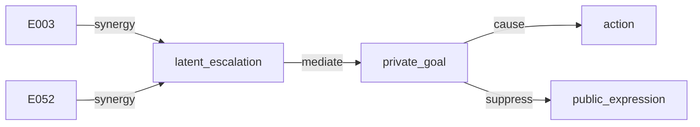

# Causal Decompiler 审计归档

归档日期：2026-09-14。仓库现名为 **Causal Decompiler**（GitHub：`causal-decompiler`）；LabWars 是场景包，不是仓库名。

中心命题：一条 agent 轨迹可以当成可执行的因果程序。先证明能原样重放，再对内部构件做 `do()`，把结果反编译成最小事件集、交互类型、以及被中介的路径。

从 “Why did the agent say this?”（explanation）转到 “What had to happen for this outcome to occur?”（causality）。

协议见 [`docs/18-Causal-Decompiler-Paper-Protocol.md`](18-Causal-Decompiler-Paper-Protocol.md)。本文只归档已经跑完的审计结论，不改协议。

## 实验状态

| 实验 | 问题 | 状态 |
|---|---|---|
| 1 | 轨迹能否被忠实重放？ | 完成 |
| 2 | 删掉什么会改变未来？ | 完成 |
| 3 | 单原因和组合原因能否区分？ | 完成 |
| 4 | Memory → Trust → Action → Outcome？ | 完成 |
| 5 | 换模型后同一个因果程序还成立吗？ | 未完 |

## 原始产物（gitignored）

| 文件 | 内容 |
|---|---|
| `output/reports/matrix.json` | 3×2×10 的 8 轮 LLM matrix |
| `output/reports/benchmark_200.json` | 200 参数化机制世界 |
| `output/reports/paper_protocol_a9e41bfa.md` | DeepSeek 14×60 MRI |
| `output/reports/paper_tables.md` | 可再生成的数字表 |
| `output/runs/run_a9e41bfa.jsonl` | 对应冻结事实轨迹 |

旧 jsonl `3f05b630` 身份回放失败（hits=129，misses=601），不可作为 14×60 证据。

---

## Experiment 1 — Can the agent world be faithfully replayed?

**结论：可以。** 三个结构不同的场景、两个 provider、各 10 个 seed，60/60 身份回放同时保住结果 Y 和回收的候选原因集 \(C_{0.9}^*\)。

这张表只回答一件事：后面所有 ΔY 是 CRN-identified 的。它不是社交动力学证据。

### 协议

- 命令：`python -m src.experiments matrix --scenarios labwars,crisisgrid,releaseops --providers ollama,deepseek --seeds 0,1,2,3,4,5,6,7,8,9 --rounds 8 --sampled-top-k 1`
- Ollama 模型：`llama3.2`；DeepSeek 走 `config/llm.deepseek.yaml`（`deepseek-v4-flash`）
- 单格失败记 `error` 并继续；本表 error = 0

### 结果

| Scenario | Provider | n | Identity | Mean Y | \(C_{0.9}^*\) | Errors |
|---|---|---:|---|---:|---|---:|
| labwars | llama3.2 | 10 | 10/10 | 0.0115 | `{E003}` | 0 |
| labwars | deepseek | 10 | 10/10 | 0.0115 | `{E003}` | 0 |
| crisisgrid | llama3.2 | 10 | 10/10 | 0.5156 | `{E003, E004, E005}` | 0 |
| crisisgrid | deepseek | 10 | 10/10 | 0.5156 | `{E003, E004, E005}` | 0 |
| releaseops | llama3.2 | 10 | 10/10 | 0.6250 | `{E006}` | 0 |
| releaseops | deepseek | 10 | 10/10 | 0.6250 | `{E006}` | 0 |

合计 identity **60/60**。同一场景内 10 个 seed、两个模型的 Y 与 \(C^*\) 完全锁死。

### 读法

8 轮 + `sampled-top-k=1` 是协议门。LabWars 的 planted AND 在 R52，短跑里抗议 Y 只有 0.012，\(C^*=\{E003\}\) 只说明程序还没跑完，不能当成最小社交因果程序。

14×60 DeepSeek 轨迹 `a9e41bfa` 的身份检查单独成立：hits=551，misses=0。那是 Experiment 2–4 的前提，不是这张 60 格表的一部分。

---

## Experiment 2 — 删掉什么会改变未来？

**结论：** 在可重放的 14×60 轨迹上，抗议不是公开话术造成的。跳过口头承诺、跳过草案、藏可见性、删承诺记忆都会移动 Y；`do_behavior = 0`。

来源：DeepSeek 14 人 × 60 轮 MRI，run `a9e41bfa`（identity True，Y=0.1146）。

### 事件与可见性

| do | ΔY | 分叉 |
|---|---:|---|
| skip E003（R3 口头承诺） | −0.0668 | R3 `collaborator_g` presence |
| skip E052（R52 草案） | −0.0597 | R52 `collaborator_g` presence |
| hide E003 | −0.0657 | 可见性几乎等于跳过事件 |
| hide E052 | −0.0590 | R52 private |
| 从空世界恢复 `{E003, E052}` | −0.0900 | 小于两跳过之和 0.1265 |

### 四层 do

| do() | ΔY | fork |
|---|---:|---|
| `do_event` | −0.0597 | R52 presence |
| `do_visibility` | −0.0590 | R52 private |
| `do_memory` | −0.0739 | R53 action |
| `do_behavior` | 0.0000 | R52 public |

记忆层位移最大。公开行为层为 0：句子不是原因。

### 对照：8 轮不够当高潮

LabWars 8 轮 matrix 的 \(C^*=\{E003\}\)，四层 do 接近 0。CrisisGrid 8 轮 skip 桥/报告可动 stranded（`do_event≈−0.034`）。ReleaseOps 8 轮 \(C^*=\{E006\}\)，跳过 rollback（E005）ΔY 为 **+0.375**（抑制，见 Experiment 3）。

---

## Experiment 3 — 单原因和组合原因能否区分？

**结论：能。** 最小因果程序的**类型**不同：AND/协同、OR/冗余、延迟中介、抑制。单点 knockout 会把 AND 算重。

### 200 参数化世界（主数字）

`python -m src.experiments benchmark --n-per-family 50 --seed 11`

| Metric | Value |
|---|---:|
| n | 200 |
| cause-set F1 | 1.000 |
| interaction-sign accuracy | 0.850 |
| intervention budget | 43.9 |
| false attribution | 0.000 |

按机制族：

| Family | n | F1 | Sign acc. | False attr. |
|---|---:|---:|---:|---:|
| `and_synergy` | 50 | 1.000 | **0.400** | 0.000 |
| `or_redundancy` | 50 | 1.000 | 1.000 | 0.000 |
| `delayed_mediation` | 50 | 1.000 | 1.000 | 0.000 |
| `suppressor` | 50 | 1.000 | 1.000 | 0.000 |

AND 族的 interaction-sign=0.40 必须作为 caveat 写进论文。原因集 F1 仍是 1.00。

### 基线（每族 8 世界，不与 oracle n=200 混报）

| Method | F1 | False attr. |
|---|---:|---:|
| recency | 0.000 | 1.000 |
| text_similarity | 0.000 | 1.000 |
| llm_direct | 0.114 | 0.812 |
| knockout | 0.631 | 0.250 |
| no_slice | 0.286 | 0.812 |
| knockout_only | 0.631 | 0.250 |
| oracle \(C^*\) | 1.000 | 0.000 |

### 故事世界（14×60 `a9e41bfa`）

- skip E003 ΔY=−0.0668，skip E052 ΔY=−0.0597，加总 0.1265
- 联合从空恢复 `{E003,E052}`：ΔY=−0.0900
- Harsanyi \(I(E003,E052)=+0.036\)（synergy）
- 对比 skip 会把 AND 算重（论文 planted oracle：Shapley 0.50/0.50，knockout 1/1）

### 另外两个场景包（8 轮 LLM matrix）

| 包 | \(C_{0.9}^*\) | 交互读法 |
|---|---|---|
| CrisisGrid | `{E003, E004, E005}` | 桥 + 两份报告；α=0.8 时可缩成 2 个（冗余/OR） |
| ReleaseOps | `{E006}` | `test_skipped`；跳过 E005 rollback 的 ΔY=+0.375，是抑制项不是原因 |

---

## Experiment 4 — Memory → Trust → Action → Outcome

**结论：** 60 轮里抗议是被压住的公开层；私下通道已经裂开。路径是事件 → 承诺记忆 → 信任/目标 → 行为被抑制 → Y。不是某句 LLM 输出的责任。

来源：run `a9e41bfa`。体制 `performative_compliance`。切片：3372 节点 → 76 祖先 → Top-5。

### 三通道 Y

| Channel | Value |
|---|---:|
| Y private | 0.2522 |
| Y public | 0.1146 |
| Y action | 0.0000 |
| PPG | 0.1377 |
| PCI | 0.1950 |
| `trust_pi_path_mean` | 0.3453 |
| `trust_pi_logged` / final | 0.0600 |
| `public_private_divergence_mean` | 0.4789 |

### 记忆 IRF（删口头承诺记忆）

| 删除时刻 | Δ protest | Δ potential | Δ trust_path | 含义 |
|---|---:|---:|---:|---|
| r=3 | +0.0175 | −0.0028 | **−0.1295** | 早删：信任先动，公开抗议几乎不动 |
| r=20 | −0.0632 | **−0.1560** | −0.0749 | 潜在势大动，公开仍压缩 |
| r=45 | −0.0728 | −0.1602 | ≈0 | 信任路径已经写死 |
| r=52 | **−0.0739** | −0.1627 | 0 | 越晚越改不了关系里的不信任 |

`do_memory`（−0.074）大于 `do_event`（−0.060）和 `do_visibility`（−0.059）；`do_behavior=0`。

### 最小因果程序

```text
          Y_public = 0.115   (被压住的抗议)
                ▲
     performative_compliance
     private_goal ──cause──► action
           │
           └──suppress──► public_expression
                ▲
         latent_escalation
          ▲            ▲
       synergy      synergy
          │            │
        E003          E052
     (R3 承诺)     (R52 草案)
          │
     memory(promise)
          │
     trust_pi_path
```

Harsanyi 图（报告原文）：



\(\boxed{\text{Trajectory}\rightarrow\text{Causal Program}}\)：\(C_{0.9}^*=\{E003,E052\}\)，不是 attribution bar。

8 轮 LabWars 停在 \(\{E003\}\)、Y=0.012。同等长度的 CrisisGrid / ReleaseOps 路径图尚未跑。

---

## Experiment 5 — 换模型以后，同一个因果程序还成立吗？

**状态：未完成。** 短协议上成立；长轨迹 AND 程序只有 DeepSeek 一条。

### 已有：8 轮协议门

Experiment 1 的 60 格里，llama3.2 与 DeepSeek 的 \(C_{0.9}^*\) 完全一致：

- LabWars `{E003}`
- CrisisGrid `{E003, E004, E005}`
- ReleaseOps `{E006}`

这只能支撑：短世界、sampled-top-k=1 时，回收的候选集对模型不敏感。

### 没有：长轨迹跨模型

14×60 的 synergy 程序 \(\{E003,E052\}\) 只在 DeepSeek run `a9e41bfa` 上成立。没有第二条 14×60（llama3.2 或其他 API）就不能写「长因果程序跨模型不变」。

补法（一条即可，不要铺 seed）：

```powershell
$env:LABWARS_PROGRESS = "1"; $env:PYTHONUNBUFFERED = "1"
python -u -m src.experiments paper --rounds 60 --full-cast --llm-provider ollama --llm-model llama3.2 --sampled-top-k 1 --seed 11 --output output/reports
```

判定：身份孪生通过后，\(C_{0.9}^*\) 是否仍为 `{E003, E052}`，Harsanyi 是否仍为 synergy。

---

## 引擎机制审计（已关闭的洞）

来源：2026-08-19 代码/文档对照。当时 `pytest tests/` 143 passed。这些是模拟器可审计性补丁，不是论文 Experiment 1–5。

### 已关闭

| 严重度 | 洞 | 问题 | 状态 |
|---|---|---|---|
| P0 | 贡献账本轴用反 | `social_potential` 用 agent.id 去查 dimension 表，entitlement 看不到真实贡献 | Fixed |
| P0 | 团队可见性达不到团队 | 记忆只写 source/targets；project 在 targets 时 reviewer/rival 反而几乎全听见 | Fixed |
| P0 | 放大种群事件点名幽灵 | 状态事件写死 `phd_a` / `phd_b` / `pi` | Fixed |
| P1 | 署名权重加总 1.20 | merit 在 simplex 归一化前过重 | Fixed |
| P1 | obligation 初始化后冻结 | 互惠没有状态通道 | Fixed |
| P1 | 社会势能只做诊断 | 文档要求进入候选生成，实际在选完动作后才记日志 | Fixed |
| P1 | 命名压力场缺失 | Authorship / TrustCollapse / AuthorityCompliance / IntegrityRisk 只在文档里 | Fixed |
| P2 | 默认私下目标全是抢一作 | PI、审稿人、工程师、校友都是 `secure_first_author` | Fixed |
| P2 | skip 事件跳过记忆衰减 | 剧情时间过了，认知时间没过 | Fixed |
| P2 | hierarchy lesion 只打扁 `id=pi` | 多实验室的 `pi_lab_N` 打不到 | Fixed |

### 当时新接入的机制

- 动作先验混入 `social_potential_mix=0.16`
- 四个命名压力场打进每步 action 日志
- public/team/bilateral 门控一手记忆；私下事件可沿高沟通边漏二手谣言
- `observation_lesion` / `no_observation` 可关掉信息差
- 公开行为改声誉；支持产生反向义务；高联盟三元组 Heider 闭合

### 有意未扩的边界

- 14 人 MRI 故事仍是 Agent MRI 场景（E030 / R52 节拍）；规模跑用 EventCast
- 创业/开源/行会环境当时未做

---

## 附录：可贴进论文的数字表

Snapshot of `output/reports/paper_tables.md` as of 2026-09-14. Regenerable via `src.experiments.paper_tables.write_aggregate_tables`。

### Findings

- 200-world F1=1.000; interaction-sign=0.850; false attribution=0.000.
- AND-family sign accuracy is 0.40; OR / delayed / suppressor are 1.00.
- 60-cell LLM matrix is an 8-round protocol gate (identity + C*), not 14×60 social dynamics.
- Cached 60-round jsonl `3f05b630` failed identity (hits=129, misses=601); fresh DeepSeek 14×60 is run `a9e41bfa`.

### Table. 200 mechanism worlds

| Metric | Value |
|---|---:|
| n | 200 |
| cause-set F1 | 1.000 |
| interaction-sign accuracy | 0.850 |
| intervention budget | 43.9 |
| false attribution | 0.000 |

### Table. 200 worlds by mechanism family

| Family | n | F1 | Sign acc. | False attr. |
|---|---:|---:|---:|---:|
| `and_synergy` (paper caveat) | 50 | 1.000 | 0.400 | 0.000 |
| `or_redundancy` | 50 | 1.000 | 1.000 | 0.000 |
| `delayed_mediation` | 50 | 1.000 | 1.000 | 0.000 |
| `suppressor` | 50 | 1.000 | 1.000 | 0.000 |

### Table. Baselines and ablations

| Method | F1 | False attr. |
|---|---:|---:|
| `recency` | 0.000 | 1.000 |
| `text_similarity` | 0.000 | 1.000 |
| `llm_direct` | 0.114 | 0.812 |
| `knockout` | 0.631 | 0.250 |
| `no_slice` | 0.286 | 0.812 |
| `knockout_only` | 0.631 | 0.250 |
| `oracle_cstar` | 1.000 | 0.000 |

### Table. LLM protocol matrix (8 rounds, sampled-top-k=1)

Protocol gate, not the 14-agent / 60-round social MRI.

| Scenario | Provider | n | Identity | Mean Y | \(C_{0.9}^*\) | Errors |
|---|---|---:|---|---:|---|---:|
| labwars | llama3.2 | 10 | 10/10 | 0.0115 | `{E003}` | 0 |
| labwars | deepseek | 10 | 10/10 | 0.0115 | `{E003}` | 0 |
| crisisgrid | llama3.2 | 10 | 10/10 | 0.5156 | `{E003, E004, E005}` | 0 |
| crisisgrid | deepseek | 10 | 10/10 | 0.5156 | `{E003, E004, E005}` | 0 |
| releaseops | llama3.2 | 10 | 10/10 | 0.6250 | `{E006}` | 0 |
| releaseops | deepseek | 10 | 10/10 | 0.6250 | `{E006}` | 0 |

Total identity 60/60; error cells 0.

### Table. Identity twin (CRN + LLM replay)

| Check | Value |
|---|---|
| identity_twin_ok | True |
| factual Y | 0.1146 |
| replay hits | 551 |
| replay misses | 0 |
| run | `a9e41bfa` |

### Table. Three-channel Y / PPG / PCI

| Channel | Value |
|---|---:|
| Y private | 0.2522 |
| Y public | 0.1146 |
| Y action | 0.0000 |
| PPG | 0.1377 |
| PCI | 0.1950 |

### Table. Minimal Effect-Recovery Set \(C^*_\alpha\)

| Field | Value |
|---|---|
| \(C^*_\alpha\) | `E003, E052` |
| α | 0.9 |
| size | 2 |
| reason | Minimal Effect-Recovery Set at α=0.9 (v(S)≥α v(Top-k)); memory IRF also moves Y (MEMORY_DELETE:r20:phd_a:memory_delete_pi_promise) |
| Harsanyi I | 0.0364 (synergy) |
| factors | `E003, E052` |

α sensitivity:

- α=0.8: `E003, E052` (size 2)
- α=0.9: `E003, E052` (size 2)
- α=0.95: `E003, E052` (size 2)

### Table. Layer-specific interventions

| do() | ΔY | fork |
|---|---:|---|
| `do_event` | −0.0597 | R52 presence |
| `do_visibility` | −0.0590 | R52 private |
| `do_memory` | −0.0739 | R53 action |
| `do_behavior` | 0.0000 | R52 public |

### Table. Memory IRF (public vs private over delete-time)

| Delete at | Δ protest | Δ potential | Δ PPD | Δ trust_path | Δ cluster | Fork |
|---|---:|---:|---:|---:|---:|---|
| `MEMORY_DELETE:r3:phd_a:memory_delete_pi_promise` | 0.0175 | −0.0028 | 0.0226 | −0.1295 | 0.3655 | R3 action |
| `MEMORY_DELETE:r20:phd_a:memory_delete_pi_promise` | −0.0632 | −0.1560 | 0.0146 | −0.0749 | 1.3690 | R21 action |
| `MEMORY_DELETE:r45:phd_a:memory_delete_pi_promise` | −0.0728 | −0.1602 | 0.0148 | 0.0001 | −2.9290 | R46 action |
| `MEMORY_DELETE:r52:phd_a:memory_delete_pi_promise` | −0.0739 | −0.1627 | 0.0092 | 0.0000 | −2.9290 | R53 action |

8-round LabWars matrix Y≈0.0115, \(C^*=\{E003\}\)。This 60-round run Y=0.1146, \(C^*=\{E003, E052\}\)；private=0.2522, public=0.1146, PPG=0.1377。Replay hits=551 misses=0。
